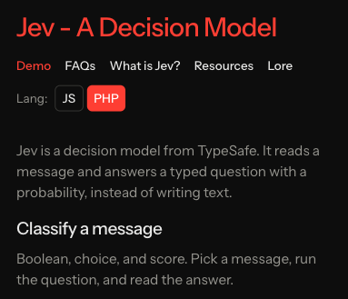

# Jev - A Decision Model

A site for [Jev](https://typesafe.ai/), TypeSafe’s decision model. Jev reads a message and answers a typed question with a probability, instead of writing text.

Live site: [jev.tibor.io](https://jev.tibor.io)

Made by [tibor.io](https://tibor.io)



The page classifies one message at a time as a boolean, a choice, or a score. Each section shows the question, the input, and the request in PHP or JavaScript. Run plays a recorded answer when `OPENROUTER_API_KEY` is empty, and calls Jev when a key is set.

## Run it locally

```bash
composer install
cp .env.example .env
php artisan key:generate
npm install
npm run build
```

PHP 8.3 or newer, with `curl`, `mbstring`, `xml`, `zip`, and `sqlite3`. Composer 2. Node is only needed for the page assets.

Leave `OPENROUTER_API_KEY` empty to replay a recorded answer. Put a key in `.env` to classify live through the OpenRouter provider in `config/ai.php` (`~typesafe/jev-latest`). Do not commit `.env`.

The site is the `/` route. The CLI stays a yes/no check:

```bash
php artisan jev:ask "Is the deploy finished?"
```

Without a key, that command exits and does not call Jev.

## Tests

```bash
php artisan test
```

## Links

- [Live site](https://jev.tibor.io)
- [tibor.io](https://tibor.io)
- [Jev by TypeSafe](https://typesafe.ai/)
- [Laravel AI SDK](https://packagist.org/packages/laravel/ai)
- [TypeSafe JavaScript SDK](https://docs.typesafe.ai/sdk/javascript)
- [OpenRouter](https://openrouter.ai/)
